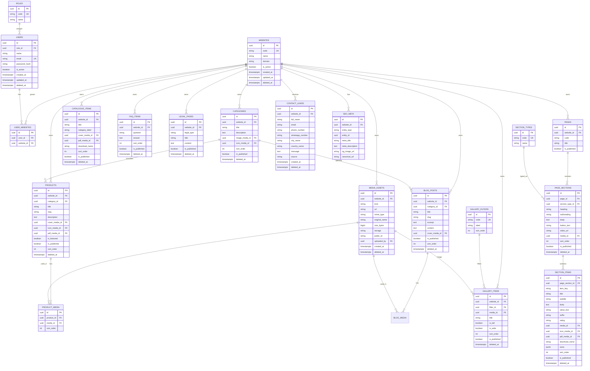

# ER Diagram

## How to read this

- **WEBSITES** is the tenant hub — all content hangs off it.
- **PAGE_SECTIONS / SECTION_ITEMS** replace the current Mongo Mixed `sections` blob for Home Management.
- **MEDIA_ASSETS** centralizes every Upload button in the admin UI.
